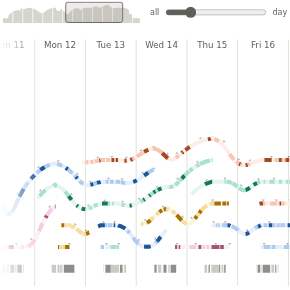

# Strata

A timeline of things that open and close - sessions, tickets, pull requests, projects, patients on a ward -
drawn as layers of cloth. Each thing is a line from when it opened to when it closed. At any moment the open
ones are stacked, the longest-lived on top, so the height of the stack shows how much was open; each line rests
on the ones beneath and drapes down where one of them ends, so the picture shows things building up and
clearing away. Along each line, stretches can be strong, medium or faint, and the strongest in each pixel
wins, so a moment of attention is never lost at any zoom. Zoom from the whole range to a day on a screen,
and the cloth re-lays at every step.



**See it live**

- [A report of two weeks of Claude Code sessions](https://public.omniscope.me/Public/Strata/Report.ior/), in
  Omniscope: zoom, scroll, point at a line, filter by workspace or time.
- [The public folder](https://public.omniscope.me/Public/Strata/): the report, the Omniscope project that
  builds it, and its data.
- [The Omniscope custom view](https://github.com/visokio/omniscope-custom-views/tree/master/strata), in the
  gallery, built from this repository: add **Strata** to any Omniscope report from the Add View menu.

## What's here

| Path | What |
|---|---|
| `src/` | The chart: `strata-cloth.js` (the cloth layout), `strata-view.js` (drawing to SVG), `strata-ui.js` (scrolling, zoom, overview strip, tooltip). Plain browser scripts, also loadable in Node; type-checked with JSDoc. |
| `customview/` | The Omniscope custom view: `index.html`, `manifest.json`, icon, thumbnail and the gallery README. |
| `tools/` | `preview.py` (a standalone page from a CSV), `compose.py` (the demo's tidy tables into the view's rows), `git-branches.py` (a git repo's branches as a Strata table), `pages.py` and `build.mjs`. |
| `examples/` | `claude-code-sessions-2026-09/` (the live demo's data, four tables), `homebrew-prs-2026-08.csv` (Homebrew's merged pull requests, Aug-Sep 2026), `git-topics-2026-09.csv` (git's topic branches, 1-14 Sep 2026). |
| `tests/` | Unit tests for the layout and drawing, and a Chromium test of the custom view against a stand-in for Omniscope's API. |

## Quick start

Python 3 and Node 18 or later. The pages need nothing installed:

```
npm run pages
```

writes one self-contained HTML page per example to `dist/pages/` - open one in a browser. Your own data:

```
python3 tools/preview.py rows.csv page.html --title "My data"
```

## Data

One row per stretch of time; the custom view's fields, by name:

| Field | Type | Example |
|---|---|---|
| Layer | any | `S12` - a session, ticket or pull request id |
| Start, End | date | `2026-09-29 09:12:53` |
| Label | text | `DEV · Release` |
| Colour | text | `DEV` - lines sharing a value share a colour |
| Emphasis | number | `2` strong, `1` medium, `0` faint |
| Foot | text | on rows with no Layer: a heavy line along the foot, up to two values |
| At | date | a moment on its line (a commit): a row with no Start or End |
| Moment | text | what kind of moment (`commit`, `merge`) |

A line runs from its rows' first start to their last end. A moment (Start and End the same, or an At) is a
tiny triangle on its line; a second kind of moment is a ticked badge. Without Foot rows, the foot line is drawn
from the lines, wherever any is strong. The full description of every setting is in
[customview/README.md](customview/README.md).

The demo's own data is four tidy tables, as they would be kept - sessions, their stretches (`me` working in
one, `claude` working in it, or `idle`), attention (where `me` was: in a session, or `other` work) and commits.
`tools/compose.py` puts them together as the Omniscope report does:

```
python3 tools/compose.py examples/claude-code-sessions-2026-09 rows.csv
```

`tools/git-branches.py` makes the same kind of table from a git repository's history, with git alone:

```
git clone --bare --filter=tree:0 https://github.com/Homebrew/brew brew.git
python3 tools/git-branches.py brew.git --from 2026-08-09 --to 2026-09-10 --depth 3 --open 1 \
  --commits moment --merges moment > homebrew.csv
```

## Building the custom view

```
npm run build
```

assembles `dist/customview/strata/`: `customview/` plus the three scripts from `src/`, the folder the gallery
takes as it is. To update the gallery, with a checkout of
[visokio/omniscope-custom-views](https://github.com/visokio/omniscope-custom-views) beside this one:

```
node tools/build.mjs --to ../omniscope-custom-views/strata
```

It replaces the files it makes and leaves anything else there (the gallery's `test.ioz`).

To use the view without the gallery, add a custom view in an Omniscope report (Add View, then View Designer),
and replace its files with those in `dist/customview/strata/`.

## Tests

```
npm install          (puppeteer-core and typescript)
npm test             (unit tests, then the custom view in Chromium)
npm run typecheck
npm run thumbnail    (re-makes customview/thumbnail.png)
```

The Chromium test finds a browser at `$CHROME`, `/usr/bin/chromium` or the usual Chrome locations, and
puppeteer-core in `node_modules` or a global install.

## Licence

MIT - see [LICENSE](LICENSE).
